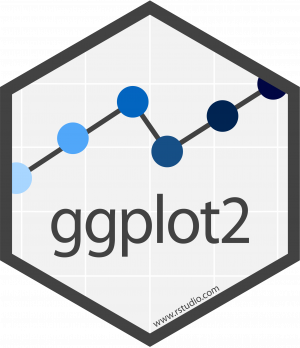

```{r setup, include=FALSE}
```

# R

## Un poco de historia sobre R

<div class="notes">
Tal como dijo Petter Diggle en su conferencia de apertura como presidente de la Royal Statistical Society, el R Project es el desarrollo de software estadistico mas importante desde los años 90. 
</div>

El lenguaje R tiene su origen en el lenguaje S y fue desarrollado por Ross Ihaka y Robert Gentleman en el Department of Statistics of the University of Auckland in Auckland, New Zealanda a mediados de los años 90. 

- Open-source
- Dirigido por la R Foundation, organizacion sin fines de lucro con sede en Vienna University of Economics and Business. 
- 17682 paquetes, al dia de hoy, dentro de CRAN (Comprehensive R Archive Network) para ampliar la funcionalidad de base.

## One IDE to rule them all

RStudio es un IDE que incrementa las capacidades de R con una variedad de funcionalidades.

- El 79% de los usuarios de R utilizan RStudio como IDE. 
- Cuenta con versiones gratuitas open-source y versiones para uso comercial. 

<div class=centered></div>

## ¿Que se puede hacer con R?

<div class="notes">
La transformacion y manipulacion implica poder importar, exportar y modificar distintas estructuras de datos desde datos tabulares a estructuras menos organizadas.
La exploracion implica las medidas de resumen y, principalmente, la visualizacion de los datos
El modelado se solapa un poco con la exploracion siendo que las medidas de resumen son en definitiva un tipo de modelo y porque muchas veces se hace la exploracion apelando al modelado (mismo incluso explorando los resultados de los mismos)
La presentacion y el reporte permiten mostrar los procesos y los resultados de un analisis de manera clara, transparente y reproducible facilitando el flujo de trabajo asi como la ciencia abierta y la replicabilidad.
</div>

- Transformacion y manipulacion
- Exploracion
- Modelado
- **Presentacion y reporte**

<div class=centered></div>

## Necesitamos librerias {.build}

Para realizar muchas de las cosas necesarias en un pipeline de analisis es necesario cargar ciertas librerias
```{r, eval = F}
install.packages('Nombredelalibreria') #Para instalar librerias
library(Nombredelalibreria) #Para cargar la libreria 
#(notese la falta de comillas)
```

La gran mayoria de las librerias que vamos a utilizar se encuentran dentro del paquete **_tidyverse_**.

> _The tidyverse is an opinionated collection of R packages designed for data science. All packages share an underlying design philosophy, grammar, and data structures._

# ¿Que es el tidyverse?

## El tidyverse {.flexbox .vcenter}

<div class='centered'></div>

## El pipeline de analisis {data-background=imgs/data-science.png}

## Importar datos {data-background=imgs/data-science-wrangle.png}


## Librerias para importar {.flexbox .vcenter}
Las librerias mas utiles para importar datos son readr y readxl, siendo esta ultima creada particularmente para archivos de Excel

<div class='centered'>


</div>

## Funciones para importar

Hay una variedad de funciones para importar siguiendo todas un formato del estilo
```{r, eval=F}
read_formatodearchivo('File/Path') 

  #Por Ejemplo
read_csv() #Para leer CSV
read_tsv() #Para leer archivos separados por Tabs
read_delim() #Para definir la delimitacion entre los elementos
#Para leer excel
read_xls() 
read_xlsx()
```

## Funciones para exportar

Las funciones para guardar una base de datos desde R sigue una logica similar a la importacion y utilizan las mismas librerias
```{r, eval = F}
write_formatodearchivo('File/Path')

write_csv()
write_tsv()
write_delim()
```

## Un dataset tidy

Tres reglas interrelacionadas:

- Cada variable tiene su propia columna
- Cada observacion tiene su propia fila
- Cada valor tiene su propia celda

<div></div>

## Generando o rompiendo un dataset tidy

Hay ocasiones en las cuales es necesario modificar la estructura de un dataset

```{r,eval=F}
pivot_longer() 
```

<div></div>

## Generando o rompiendo un dataset tidy

Podemos pasar facilmente de un formato *long* a un formato *wide*

```{r, eval=F}
pivot_wider()
```

<div></div>

## Proximo paso

<div></div>

## Transformaciones

<div></div>

# Graficos, un capitulo aparte

## Haciendo graficos {.flexbox .vcenter}

<div class="notes">
ggplo2 es el paquete mas usado regularmente por los usuarios de R.
</div>

<div class='centered'></div>

## Grammar of graphics

<div class='centered'>

Constituye la base del uso de ggplot y librerias asociadas.
</div>

## Data

```{r pressure}
library(ggplot2)
### <b>
ggplot(data = pressure)
### </b>
```

## Aesthetics
```{r}
ggplot(data = pressure, 
       ### <b> 
       mapping = aes(x = temperature, y = pressure)) ###</b>
```

## Geomas
```{r}
ggplot(data = pressure, mapping = aes(x = temperature, y = pressure)) +
  ### <b>
  geom_point()
  ### </b>
```

## Geomas diferentes
```{r, fig.show="hold", out.width="50%"}
ggplot(data = pressure, mapping = aes(x = temperature, y = pressure)) +
  ### <b>
  geom_line()
  ###</b>

ggplot(data = pressure, mapping = aes(x = temperature, y = pressure)) +
  ### <b>
  geom_step()
  ### </b>
```

## Combinacion de geomas
```{r}
ggplot(data = pressure, mapping = aes(x = temperature, y = pressure)) +
  ###<b>
  geom_point() +
  geom_line()
  ###</b>
```

## Extendiendo ggplot: GGally

La funcion `ggpairs()` del paquete *GGally* es muy util para la visualizacion de datos multivariados.

```{r, message = F, out.width='66%', fig.align='center'}
GGally::ggpairs(iris)
```

## Extendiendo ggplot: ggpubr

El paquete ggpubr posee diversas funcionalidades utiles en graficos aptos para presentacion en el mundo academico.

```{r, warning = F, echo = F, out.width='75%', fig.align='center'}
data("ToothGrowth")
df <- ToothGrowth
p <- ggpubr::ggboxplot(df, x = "dose", y = "len",
                color = "dose", palette =c("#00AFBB", "#E7B800", "#FC4E07"),
                add = "jitter", shape = "dose")
my_comparisons <- list( c("0.5", "1"), c("1", "2"), c("0.5", "2") )
p + ggpubr::stat_compare_means(comparisons = my_comparisons) + 
  ggpubr::stat_compare_means(label.y = 50)                   
```

## Haciendolo interactivo: plotly

La libreria plotly permite convertir graficos de ggplot en graficos interactivos

```{r,echo = F, out.height='25%', fig.align='center'}
plotly::ggplotly(
  ggplot2::qplot(iris$Sepal.Length, iris$Sepal.Width)  
)
```

## Recursos complementarios {.flexbox .vcenter}

<div class='centered'>
<a href=https://es.r4ds.hadley.nz//>
</img></a></div>
