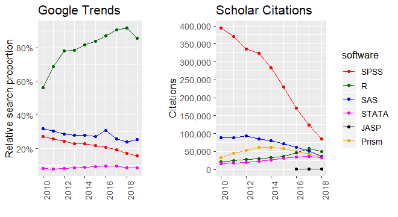
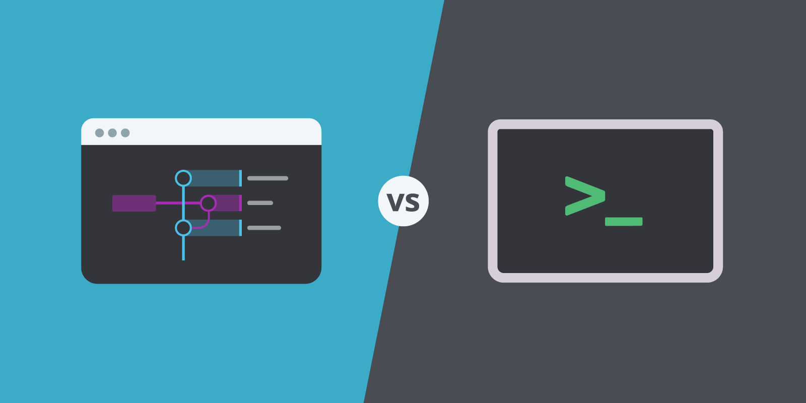
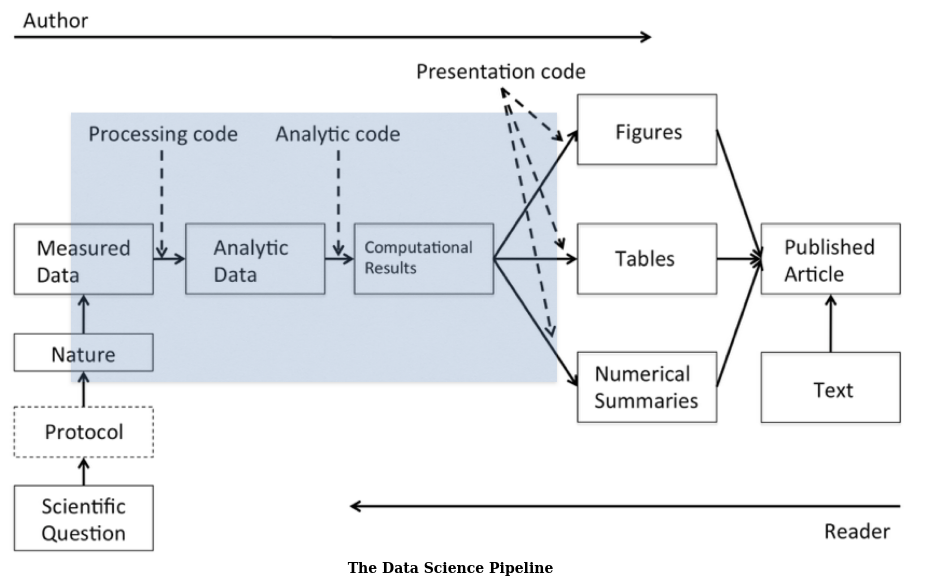
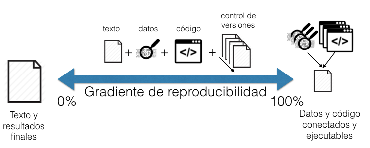
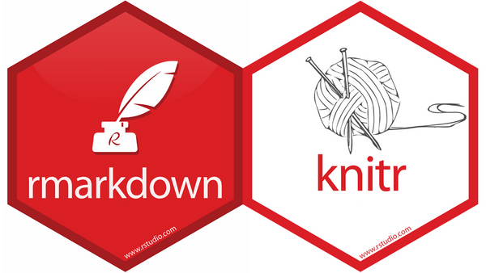
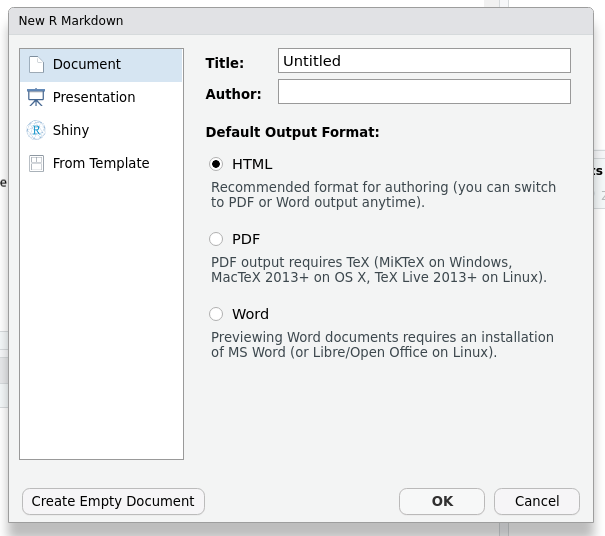
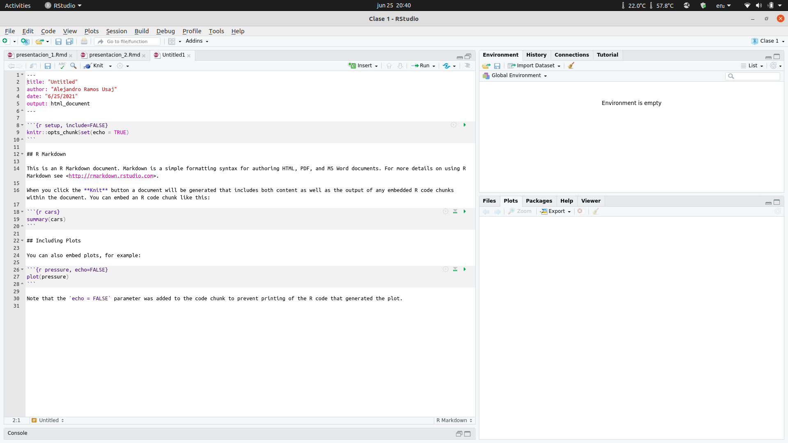
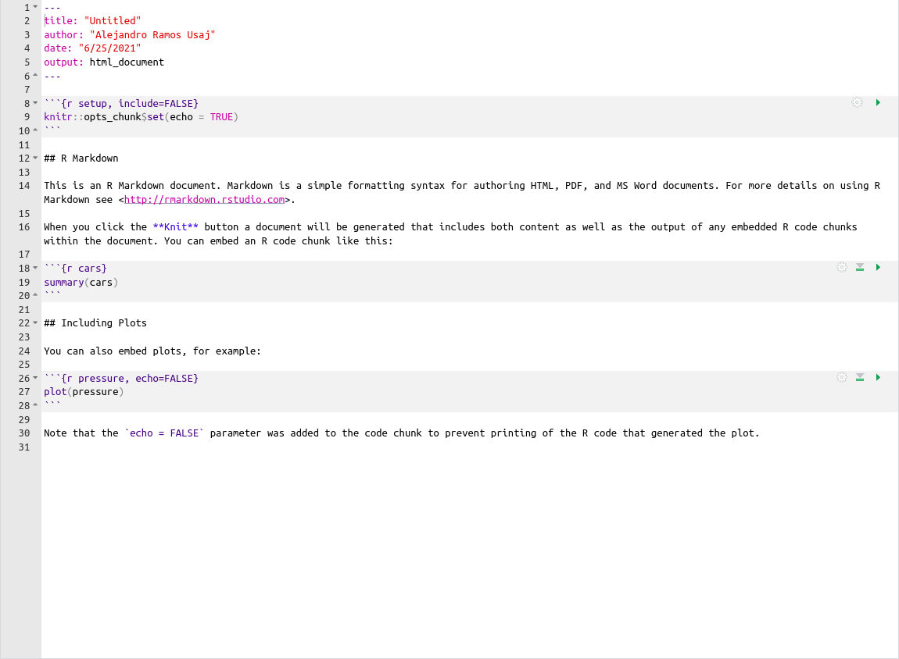

```{r, setup, include = F}
knitr::opts_chunk$set(eval = F)
```

# ¿Para que?

## Una historia de terror

<iframe width="560" height="315" src="https://www.youtube.com/embed/s3JldKoA0zw" title="YouTube video player" frameborder="0" allow="accelerometer; autoplay; clipboard-write; encrypted-media; gyroscope; picture-in-picture" allowfullscreen></iframe>

## Motivacion

> - Permitir que tanto codigo como explicaciones (texto) esten en un solo lugar con un orden logico segun el flujo del proceso de analisis.
> - Los resultados se actualizan de manera automatica, reflejando cambios en el codigo, los datos, etc.
> - El codigo se genera en vivo lo cual implica detectar errores antes de generar el documento. 

<div class= centered></div>

## Algunas reglas

No hacer las cosas a mano

Por ejemplo:

- Editar hojas de calculo para "limpiarlas" (remover outliers, validar datos individuales, etc)
- Editar tablas o figuras
- Mover datos en la computadora
- Realizar transformaciones sobre datos

No es solo una cuestion de automatizacion sino de documentacion.

## Algunas reglas 

No usar interfaces graficas

<div class=centered>
</div>
<div class=centered>
</div>


# Reproducible Reporting

## Reportes reproducibles

<div class="notes">
La replicacion es el elemento mas importante a la hora de corroborar y verificar resultados.

No siempre es sencillo replicar un estudio y hay cuestiones economicas o de otro tipo de factibilidad involucradas que dificultad la replicacion.
Sin embargo es posible llegar a un terreno intermedio donde el objetivo es que los datos utilizados y los metodos computacionales esten disponibles para que otras personas puedan repetir el proceso y llegar a los mismos resultados. 

Los reportes reproducibles son una validacion del proceso de analisis. 
</div>

> - Los datos y metadatos tienen que estar disponibles
> - El codigo debe ser lo suficientemente especifico para que las personas puedan examinarlo
> - Todos los pasos del analisis, incluyendo el pre-procesamiento, deben estar descriptos.

<div class=centered></div>

## El pipeline de analisis (otra vez)

<div class="notes">
Hay mucho mas del analisis que lo que se ve en un paper incluso en un reporte escrito de analisis. 

El autor del reporte/analisis avanza en este pipeline de izquierda a derecha mientras que el lector/receptor avanza en sentido contrario.

El objetivo de la reproducibilidad es que estos autores se "encuentren" en el medio (la parte azul).
</div>

<div class=centered></img></div>

## Elementos para la reproducibilidad

<div class="notes">
Los datos analiticos son aquellos usados para el analisis, por ejemplo un subset de los datos crudos.
El codigo analitico es el codigo que fue aplicado para producir los resultados puede ser codigo de pre-procesamiento, modelado, graficos, etc.
La documentacion es tanto de los datos como del codigo de manera que cualquiera pueda entender lo que se hizo.
La distribucion implica un medio estandar para distribuir estos elementos (ej. github o rpubs)
</div>
Datos (analiticos y crudos)

Codigo analitico

Documentacion

Distribucion

<div class=centered></div>

## Integrando todo con programacion literaria estadistica 

Proviene de la programacion literaria (literate proramming)

Implica poder mezclar codigo y texto (plano) en un solo flujo de trabajo y reporte. La idea es que se necesite un solo documento donde se haga todo.

El proceso de analisis se describe en una serie de bloques (chunks) de texto y codigo. El texto es apto para personas y el codigo es apto para maquinas. 

# Reportes en R

## knitr: llevando las cosas a R {.flexbox .vcenter}

El paquete *knitr* toma muchas ideas de programacion literaria y otorga un comodo marco para trabajar. 

Permite integrar distintos lenguajes ademas de R (como Python, Bash o SQL) y utilizar lenguajes de etiquetado como LaTeX o HTML, entre otras muchas funciones. 

<div class=centered></img></div>

## RMarkdown: el ultimo ingrediente

<div class="notes">
RMarkdown es una variante de Markdown para R, creada por RStudio. 

Markdown es un lenguaje de texto a HTML creado por John Gruber.

“Markdown is a text-to-HTML conversion tool for web writers. Markdown allows you to write using an easy-to-read, easy-to-write plain text format, then convert it to structurally valid XHTML (or HTML).”

Otros lenguajes markup son por ejemplo LaTeX o HTML. Markdown permite enfocarse en la escritura en lugar del formateo debido a sus elementos simples y minimalistas. 

Un archivo RMarkdown puede ser convertido a un markdown normal usando el paquete knitr donde los elementos de codigo de R se convierten al formato markdown lo cual puede ser luego convertido en otros formatos 
</div>

Es una libreria inspirada en markdown que permite guardar y ejecutar codigo ademas de generar reportes (usando knitr), dentro de un mismo archivo.

Facilita utilizar programacion literaria dentro de R exportando los resultados como archivos HTML, PDF, Word, presentaciones, etc. 

<div class=centered></div>

## Pros y cons

Pros:

> - Manuales
> - Documentos tecnicos de corta/mediana longitud
> - Tutoriales
> - Reportes (especialmente cuando existe periodicidad en su generacion)
> - Preprocesamiento de datos y resumenes de datos
> - Presentaciones simples con enfasis en los datos

Cons:

> - Articulos muy largos
> - Documentar procesos computacionales muy complejos o que consumen mucho tiempo
> - Documentos o presentaciones que requieren de un formato preciso

# Manos a la obra

## Pasos iniciales: creacion del documento

Para generar un archivo de RMarkdown (posterior instalacion de las librerias necesarias) se debe seguir el siguiente esquema

> *File > New File > R Markdown...*

<div class=centered></div>

## Pasos iniciales: elementos de RMarkdown

<div class=centered></div>

## Pasos iniciales: elementos de RMarkdown

<div class=centered></div>

## Elementos: Metadatos

<div class="notes">
La indentacion importa en YAML. 
</div>

Es todo lo que esta entre los tres pares de guiones `---` y se escribe con la sintaxis YAML en la forma de pares *key:value*

Hay muchos elementos que pueden definirse en el YAML como:

<div class="columns-2">

- output (HTML, PDF, Word, etc.)
- Abstract
- Tabla de contenidos
- Bibliografia
- Estilos (theme)
- Parametros de las figuras (alto, ancho, pie de figura)
- ...y mucho mas

</div>

## YAML basico

```{yaml}
---
title: 'Un titulo ingenioso'
subtitle: 'Si quisiera podria agregar un subtitulo'
author: 'Nombre y apellido'
output: html_document
(pdf_document/word_document/github_document/html_notebook,ioslides_presentation)
---
```

Existen una amplia variedad de outputs dependiendo del argumento que se pase, tambien puede pasarse una lista de outputs

<div class=centered></div>

## YAML extendido

```{yaml}
---
title: 'Un titulo ingenioso'
subtitle: 'Si quisiera podria agregar un subtitulo'
author:
  name: 'Nombre y Apellido'
  affiliation: 'Instituto/Laboratorio/Universidad'
  email: 'micorreo@mail.com'
date: Fecha 
abstract:
  "Lorem ipsum dolor sit amet, consectetur adipiscing elit. Nunc a viverra nibh."
output:
  html_document:
    toc: true/false
    toc_float: true/false
    toc_depth: un numero
    number_sections: true/false
    code_folding: hide/show
    theme: pueden consultarse en la libreria Bootswatch
    highlight: estilo de highlight para la sintaxis
---
```

## Dos tipos de HTML

`html_notebook` es una variacion de `html_document` y aunque el output renderizado es practicamente igual, tienen propositos distintos. El documento esta orientado a la divulgacion y comunicacion mientras que el notebook esta enfocado en la colaboracion. El notebook tambien contiene el _source code_ completo lo que implica que puede usarse el `.nb.html` para visualizar o replicar el archivo `.Rmd` en RStudio. 

Ademas los notebooks tienen una ventaja que es que permiten trabajar de manera iterativa en una misma sesion. Esto ademas proporciona una funcion de *Preview* que renderiza unicamente los bloques de codigo que ya se hayan ejecutado, no ejecuta ningun bloque a diferencia del Knit que inicia una sesion nueva y ejecuta todo el documento (lo cual toma mucho mas tiempo).

<div class=centered></div>

## Elementos: Cuerpo

Implica todo el texto (plano) enriquecido que esta formateado con sintaxis de Markdown lo cual no inhabilita la posibilidad de usar otros etiquetados como HTML. 

Se utiliza para documentar el reporte

```{r}
Va entre los bloques de codigo como este
```

El formateo del cuerpo organiza y ordena el documento. 

## Sintaxis de Markdown en el cuerpo

Puedo generar `*italicas*` y `**negritas**` usando asteriscos. 

Para las citas se usa el signo de mayor >. 

Subindices con el tilde **~** y superindices con el caret **^**

`[El texto de un hipervinculo aca](y la url aca)` y tambien funciona dentro del mismo documento `[Ir a la seccion X][Titulo de la seccion]`

```{r}
- bullet points con guiones
* pero tambien usando asteriscos
  * con distintos niveles
  * pero siempre separado por un espacio luego del simbolo
``` 

Ecuaciones pueden escribirse usando sintaxis de LaTeX.

Por ultimo puedo generar lineas horizontales usando tres asteriscos `***`

## Encabezados

Los encabezados se merecen una mencion aparte porque no solamente cumplen una funcion estetica sino que organizan el documento

```{r}
De mayor a menor
# Encabezado 1

## Encabezado 2

### Encabezado 3

#### Encabezado 4

etc...
```

## Formato encabezados 

Los encabezados pueden ser formateados con distintas opciones

```{r}
Utilizando "{-}" o "{.unnumbered}" como sufijo se evita que ese encabezado sea numerado

Usar "{.unlisted}" como sufijo elimina un encabezado de la tabla de contenidos

Agregando "{.tabset}" al final de un encabezado de segundo nivel,
se generan pestañas con los encabezados de tercer nivel

## Encabezado de segundo nivel {.tabset}

### Primera pestaña

### Segunda pestaña

```

## Elementos: Codigo

Hay dos tipos de codigo

````
```{r} `r ''`
Bloques de codigo con esta sintaxis
```
````
y el codigo que aparece fuera de los bloques (inline) que usa `` `r knitr::inline_expr("otra sintaxis distinta")` ``

## Opciones de bloque

Los bloques (chunks) de codigo poseen sus propios argumentos que definen su comportamiento lo cual puede ser hecho:

- Para cada bloque *{r, nombre_del_bloque, agregandolo aca}*
- Para todos los bloques usando la funcion de knitr *knitr::opts_chunk$set*

Algunos de los mas utilizados son:

- `echo`
- `results`: hide/asis/markup/hold
- `highlight`
- `warning`, `message`, `error`
- `collapse`
- `include`,`eval`
- `fig.width`, `fig.height`, `fig.align`, `fig.cap`, `fig.show`, ...

## Codigo inline

Resulta muy util para sistematizar y automatizar la escritura. 

```{r}
anova_obj <- summary(aov(dep_var ~ ind_var, dataset))
```

El ANOVA entre las tres condiciones arroja un estadistico F de `` `r knitr::inline_expr('anova_obj[[1]][[1,4]]')` `` y un valor de *p* de `` `r knitr::inline_expr('anova_obj[[1]][[1,5]]')` ``

Esto puede hacerse incluso dentro de strings en secciones de YAML como el abstract.

## Graficos

Simplemente se utiliza el codigo para generar el grafico dentro de un chunk

```{r}
plot(cars, pch = 19)
```

Pueden agregarse multiples graficos y controlar la forma en que se van a mostrar

````

```{r, graficos, fig.align='center', fig.show="hold", out.width="50%"}`r ''`
plot(cars, pch = 19)
plot(pressure, pch = 17)
```

````

## Tablas

Las tablas tienen que ser generadas a partir de un data frame siendo que otro tipo de elementos *table-like* no van a ser tan sencillos de renderizar

```{r, eval = T}
# Tabla renderizada sin problemas
knitr::kable(head(iris))
```

## Tablas YAML

Ademas se puede mejorar la visualizacion por defecto de una tabla con el argumento `df_print` 

```{yaml}
output:
  html_document:
    df_print: default/kable/tibble/paged/...
```

## Mejores tablas aun con *gt*

<div class="notes">
Gracias a Matias Andina por la recomendacion de la libreria gt
</div>

Vamos a conocer a la libreria *gt* que es mantenida por el equipo de RStudio.

<div class=centered>
</div>

## La libreria *gt*

Permite una enorme flexibilidad en el armado de tablas para distintos fines. 

<div class=centered>
</div>

## La libreria *gt*

Facilmente integrable en nuestro habitual flujo de trabajo.

<div class=centered>
</div>

# Para concluir

## Parametrizacion

Los reportes parametrizados permiten espeficar uno o mas parametros para personalizar el analisis de manera que un mismo template pueda ser re-utilizado con facilidad y eliminando la necesidad de crear varios archivos o copiar y pegar. Esto resulta util para:

* Mostrar resultados para distintas condiciones
* Correr los analisis bajo distintos supuestos
* Controlar el comportamiento de knitr

## Parametros

Los parametros se definen dentro de la seccion YAML

```{yaml}
---
title: "Un titulo"
output: html_document
params: 
  condicion: WT
  datos: mi_dataset.csv
  fecha: !r Sys.Date()
  mostrar_codigo: false
---
```

Pueden ser cualquier tipo de objeto de R incluyendo expresiones. 

````
```{r}
knitr::opts_chunk$set(echo = mostrar_codigo)
read_csv(datos) %>% filter(col == condicion)
```
````

## Shiny

Permite generar reportes no solo interactivos sino reactivos.

<div class=centered>


</div>


## Un par mas de trucos

La funcion `knitr::spin()` puede convertir scripts comunes de R en reportes de forma directa permitiendo.
La funcion `knitr::purl()` permite extraer unicamente el codigo de un R Markdown para quedarnos con un script.


## Recursos Complementarios

<div class=centered>
<a href='https://leanpub.com/reportwriting'>

</a>
<a href='https://bookdown.org/yihui/rmarkdown/'>

</a>
</div>
